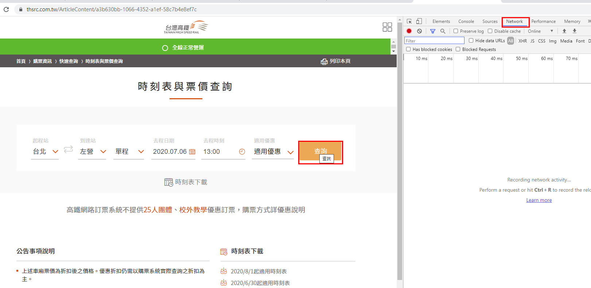
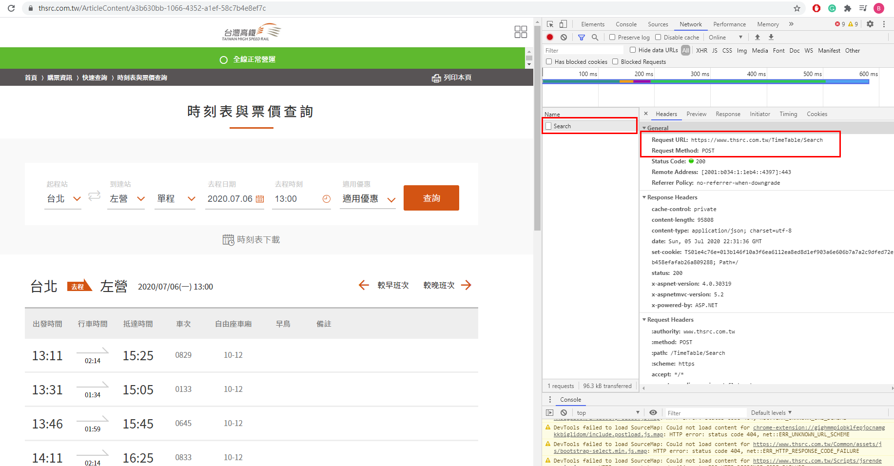
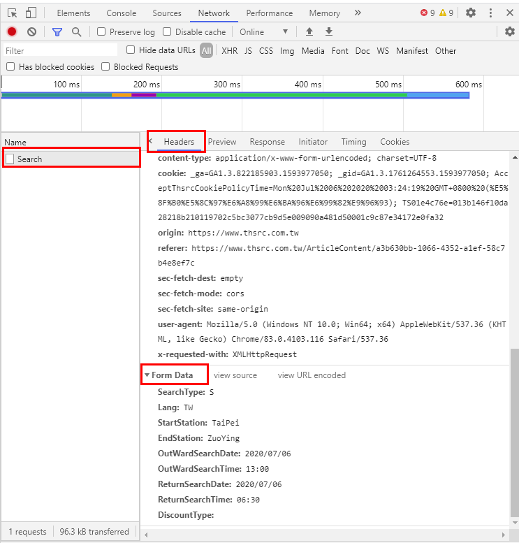
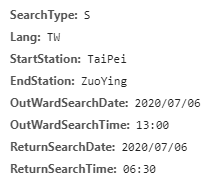
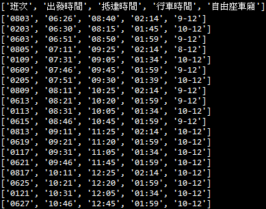

# 時刻表查詢
有些網頁的資訊無法直接的從網頁取得，也就是無法透過 request.get( url ) 取得，
<br>必須要與網站有一些互動，才可以取得資料，所謂的互動就是指填寫表單，
<br>這時就是HTTP的POST方法。

<br>首先進入高鐵的**時刻表與票價查詢**，網址如下:<br>
 [https://www.thsrc.com.tw/ArticleContent/a3b630bb-1066-4352-a1ef-58c7b4e8ef7c](https://www.thsrc.com.tw/ArticleContent/a3b630bb-1066-4352-a1ef-58c7b4e8ef7c)
<br>按下F12進入CHROME瀏覽分析環境，點選右上方的Networks頁面標籤，
<br>假設我們要查詢2020/7/6日約13:00從台北到左營的時刻表，參考以下輸入:


<br>按下**查詢**，可以看到以下畫面。


<br>可以在上圖右方的**Name欄位**選Search，
<br>此時參考右邊在**Headers頁面標籤**下可以看到**Request Method: POST**。
<br>上圖需要特別留意的是台灣高鐵使用了不同的網頁處理表單，圖中網址如下:<br>
 [https://www.thsrc.com.tw/TimeTable/Search](https://www.thsrc.com.tw/TimeTable/Search)
 <br>我們將在程式碼中使用這個網址達成HTTP的POST方法。

<br>如果繼續往下可以看到所填寫的**表單 Form Data**。

<br>上述表單有幾個重要的欄位，我們可以使用爬蟲送出這些欄位，然後取得時刻表查詢的這些資訊。
<br>
<br>

<br>上圖的SearchType、Lang、StartStation、EndStation、OutWardSearchDate、OutWardSearchTime、ReturnSearchDate、ReturnSearchTime 是我們傳送表單必填的欄位。
<br>其中**出發站**和**終點站**必須以編碼方式處理，
<br>可以參考本專案中的另一支程式 : **查詢台灣高鐵的站名與編碼**，
<br>得到所有車站的編碼。


<br><br>程式碼:<br>
```python
#列出2020/7/6日當天班次以及出發和抵達時間，同時列出行車時間和自由座車廂
import requests, bs4
#此網址為送出表單時，Request URL 的網址
url = 'https://www.thsrc.com.tw/TimeTable/Search'
#執行此程式時可能需要調整送出的表單欄位的內容
form = {
        'SearchType': 'S',
        'Lang': 'TW',
        'StartStation': 'TaiPei',
        'EndStation': 'ZuoYing',
        'OutWardSearchDate': '2020/07/06',
        'OutWardSearchTime': '13:00',
        'ReturnSearchDate': '2020/07/06',
        'ReturnSearchTime': '06:30'
        }

htmlfile = requests.post(url, data = form)
time_table = htmlfile.json()

col = ['TrainNumber','DepartureTime','DestinationTime','Duration','NonReservedCar']
schedules = [['班次','出發時間','抵達時間','行車時間','自由座車廂']]
for t in time_table['data']['DepartureTable']['TrainItem']:
    reg = []
    for c in col:
        reg.append(t[c])
    schedules.append(reg)
for s in schedules:
    print (s)
```
<br><br>執行結果:<br>

