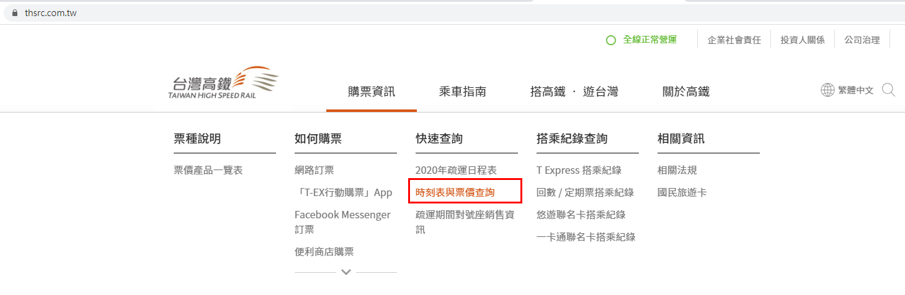
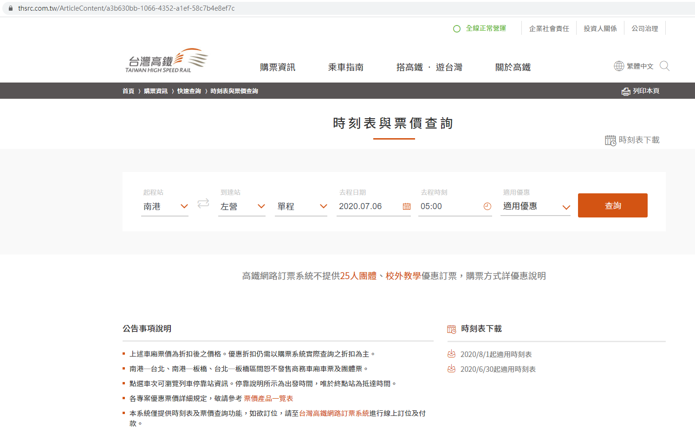
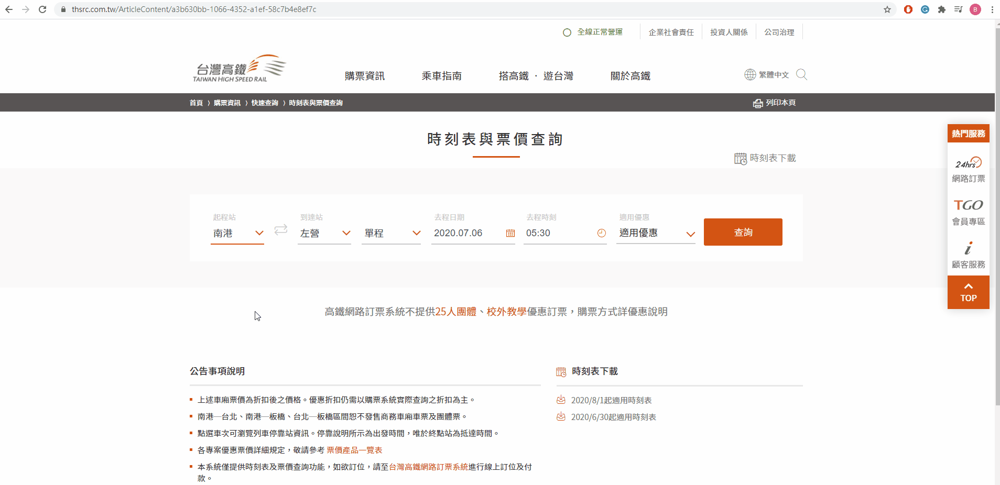
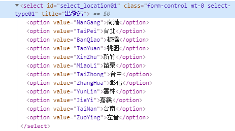

# 查詢台灣高鐵的站名與站名編碼

 請輸入下列網址進入台灣高鐵網站。
網址: [https://www.thsrc.com.tw/](https://www.thsrc.com.tw/)
 可以看到下列畫面，請點選**時刻表與票價查詢**。
 

 點選後會進入以下網站，
網址: [https://www.thsrc.com.tw/ArticleContent/a3b630bb-1066-4352-a1ef-58c7b4e8ef7c](https://www.thsrc.com.tw/ArticleContent/a3b630bb-1066-4352-a1ef-58c7b4e8ef7c)
 該網址對於未來爬取高鐵時刻表與高鐵站名有關。
 

 由於現在想要查詢台灣高鐵的各個站名與站名的編碼，所以要分析**出發站**，
請將滑鼠游標移至**出發站**，按一下滑鼠右鍵，開啟快顯功能表然後執行**檢查**。
 

 請點開上述gif檔的紅圈內的&lt;select ...&gt;標籤，結果如下。
 

從上述可以看到可以在&lt;select id="select_location01"...&gt;標籤內看到除了出發站名稱，
&lt;option&gt;標籤內的value有一個編碼，這一個編碼就是高鐵站名的編碼。
