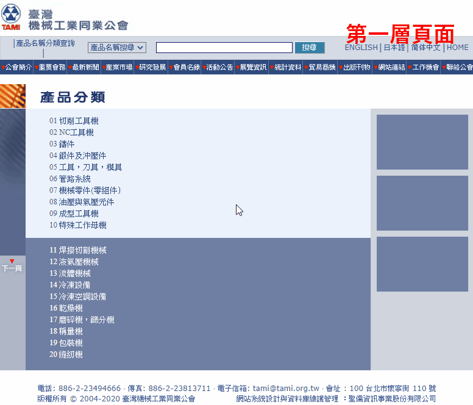
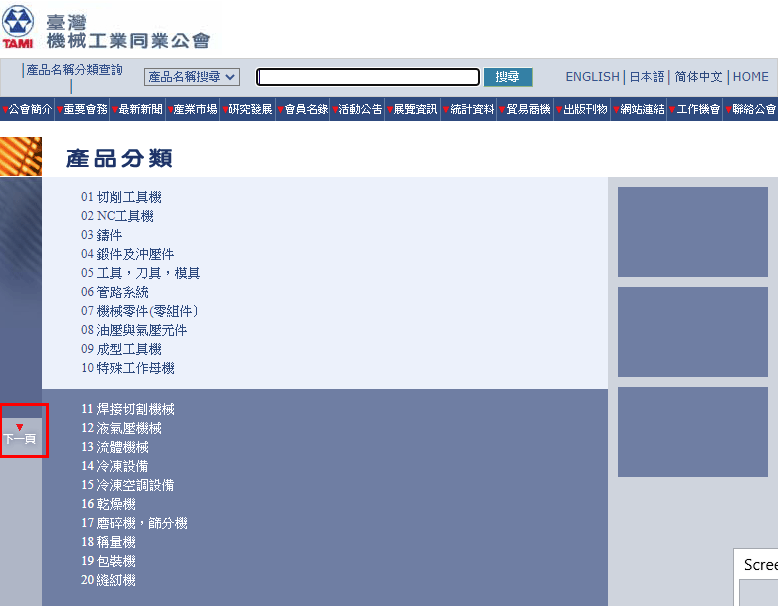
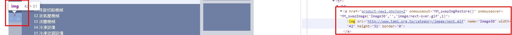
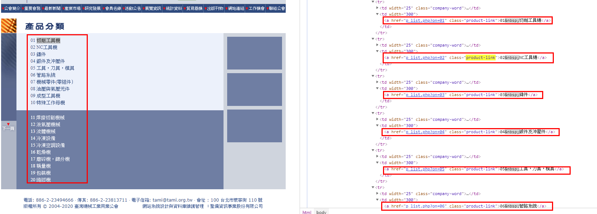
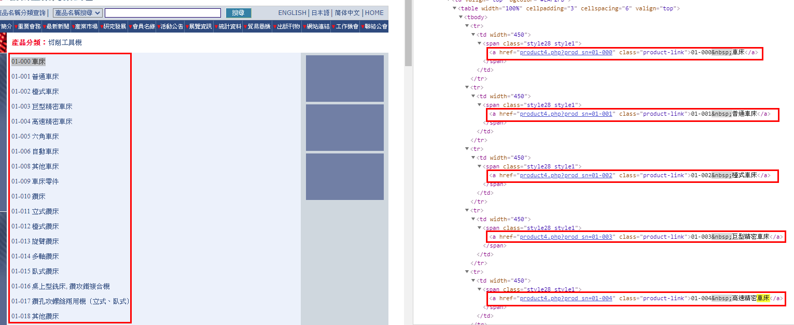
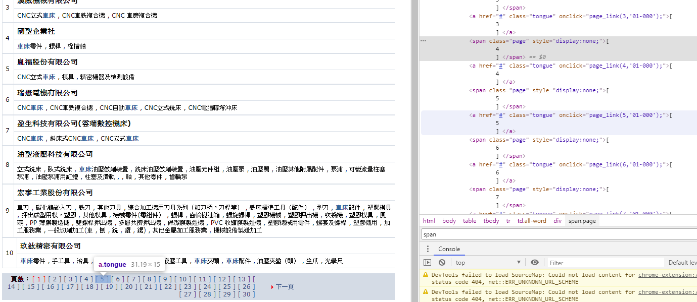
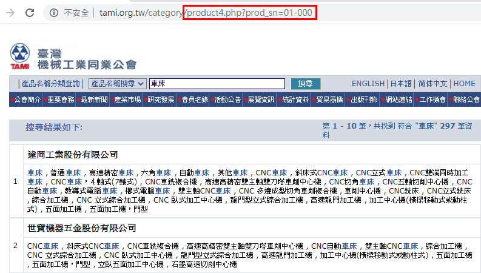
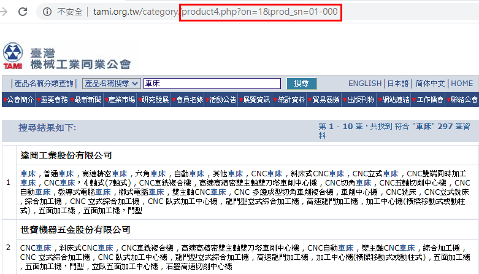
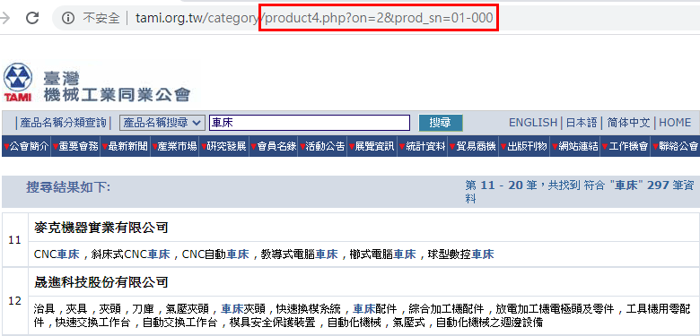
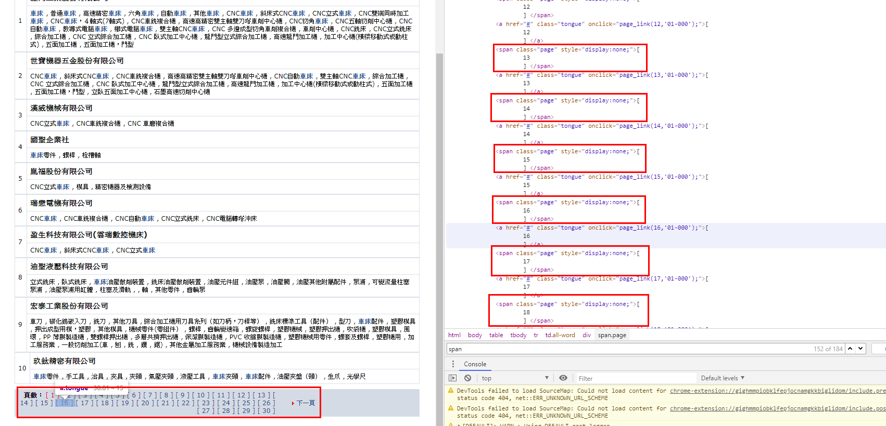

# [Python教學]Request和BeautifulSoup爬蟲教學

實作對象為: [臺灣機械工業同業公會-會員名錄](http://www.tami.org.tw/category/product-new1.php)

針對本次爬蟲，需要有以下套件:

## Python套件介紹

### request
建立各種 HTTP 請求，從網頁伺服器上取得想要的資料

[request參考資料](https://blog.gtwang.org/programming/python-requests-module-tutorial/)

### BeautifulSoup
可以快速解析網頁 HTML 碼，從中翠取出使用者有興趣的資料

[BeautifulSoup參考資料](https://blog.gtwang.org/programming/python-beautiful-soup-module-scrape-web-pages-tutorial/)

### io
負責開啟檔案、關閉檔案的套件
### time
負責處理時間上的運算。而且短時間內大量抓取資料會消耗網站資源，影響網站運行，請設定睡眠時間，避免造成對方主機的負擔
### pandas
Python 中常用的資料前處理套件，提供高效能、簡易使用的資料格式(DataFrame)讓使用者可以快速操作及分析資料

[pandas參考資料](https://oranwind.org/python-pandas-ji-chu-jiao-xue/)

***

## 正式Coding

### 大致流程
爬蟲最重要的是要流程
<br>使用者如何操作，我們就如何爬蟲


流程如下:
  1. 開啟會員名錄頁面
  2. 點開第一層產品分類
  3. 點開第二層產品分類
  4. 點開公司名稱
  5. 擷取公司資料

<br>以上為基本流程，重複上述步驟的過程中，可能會遭遇到換頁、點擊按鈕等動作

***
接著開始正式爬蟲~~~

<br>首先引入我們需要使用的套件(相關套件教學再上方)
``` python
import pandas as pd
import requests
from bs4 import BeautifulSoup
import time
import re
```

<br>做一個休息的def，每爬一筆，我們休息數分鐘
<br>為了是不要讓對方server把我們當作DDOS擋下，等於說我們是做一個模仿使用者情境的爬蟲
``` python
def sleeptime(hour,min,sec):
    return hour*3600 + min*60 + sec;
```

<br>做一個清理字串的def
<br>由於本次爬蟲中，爬到的字串常包含一些奇怪的字元
<br>因此，我們在爬蟲的過程中先做個簡易的字串清理
``` python
def Text_Clean(text):
    new_text = text.replace("\n","").replace("\r","").replace("\t","").replace(" ","").replace('\xa0', ' ')
    rstr = r"[\/\\\:\*\?\"\<\>\|]"  # '/ \ : * ? " < > |'
    new_text = re.sub(rstr, " ", new_text)
    return new_text
```

<br>接著開啟F12 ( 或Ctrl + Shift + I )，尋找要爬的特定內容
<br>我們觀察一下網站格式，這時我們看到了**下一頁**的圖示
<br>

<br>尋找**下一頁**圖示的標籤名稱
<br>這時我們發現標籤&lt;a&gt;含有**下一頁**圖示以及該圖示連結的網址
<br>

<br>做一個回傳**下一頁**圖示連結的def
<br>以當前網址為輸入，回傳**下一頁**圖示連結的網址
``` python
def Next_Image_link(Current):
    request = requests.get(Current) # 將此頁面的GET下來
    soup = BeautifulSoup(request.text,"html.parser") # 將網頁字串資料以html.parser解析
    reg = soup.find_all('a')
    for tag in reg :
        if tag.find('img'):       #再從標籤<a>找標籤
            image = tag.find('img')['src']
            if(image == 'image/next.gif'):    #利用標籤的屬性src，確認是否是我們要找的圖
                return 'http://www.tami.org.tw/category/'+tag['href']   #確認後，回傳該標籤<a>的屬性href(網頁連結)
    return None
```
<br>接下來定義目前網頁網址以及多個蒐集資料的空list
```python
Current_1 = "http://www.tami.org.tw/category/product-new1.php"
layer_1_list,layer_2_list,name,company_phone,company_fax,company_address,factory_phone,factory_fax,factory_address,company_url,capital,email,employee,main_product = [],[],[],[],[],[],[],[],[],[],[],[],[],[]

```
<br>寫一個do-while迴圈，之後的爬蟲程式碼都放這裡面
<br>當我們爬完目前頁面的資料，藉由上面定義的函式Next_Image_link()得到下一頁的網址
<br>如果下一頁的網址等於目前的網址，代表爬蟲結束
<br>反之，繼續爬蟲
``` python
while True :
	#其他爬蟲程式碼放這裡
	
    if Next_Image_link(Current_1) == Current_1 :
        break   
    Current_1 = Next_Image_link(Current_1)
```

<br>搞定第一層頁面的換頁功能後，我們接下來要進入第二層頁面
<br>如何進入第二層頁面呢?一樣先來觀察第一層頁面的html
<br>我們可以看到&lt;a&gt;含有進入第三層的連結
<br>(注意:淺色背景、深色背景的&lt;a&gt;的屬性class不同，
<br>屬性class的值分別為product-link、product-link2)
<br>

<br>我們將第一層頁面解析後
<br>利用find_all(')，找出標籤為&lt;a&gt;且屬性class的值分別為product-link或product-link2的html語句，存入layer_1 
<br>利用for迴圈遍歷所有第一層頁面到第二層頁面的連結
``` python
while True :
    request_1 = requests.get(Current_1) # 將此頁面的GET下來
    soup_1 = BeautifulSoup(request_1.text,"html.parser")  # 將網頁字串資料以html.parser解析
    
    layer_1 = soup_1.find_all('a', { 'class': ['product-link','product-link2']})
    
    for tag_1 in layer_1:
	#其他爬蟲程式碼放這裡
	
    #...
```
<br>進入第二層頁面，我們可以觀察到此頁面並沒有換頁的選項
<br>因此我們直接觀察如何進入第三層頁面就好，一樣觀察第二層頁面的html
<br>我們可以看到標籤為&lt;a&gt;且屬性class的值為product-link的html語句有我們需要的連結
<br>

<br>我們將第二層頁面解析後
<br>利用find_all(')，找出標籤為&lt;a&gt;且屬性class的值為product-link的html語句，存入layer_2 
<br>利用for迴圈遍歷所有第二層頁面到第三層頁面的連結
``` python
while True :
	#...    
    for tag_1 in layer_1:       
        layer_1_name = Text_Clean(tag_1.text)   #別忘了記錄第一層產品分類名稱        
        Current_2 = 'http://www.tami.org.tw/category/'+tag_1['href']
        request_2 = requests.get(Current_2)
        soup_2 = BeautifulSoup(request_2.text,"html.parser")        
        layer_2 = soup_2.find_all('a', { 'class': 'product-link'})        
        for tag_2 in layer_2:
		#其他爬蟲程式碼放這裡
    #...
```
<br>進入第三層頁面，我們可以觀察到此頁面出現了頁數選項
<br>觀察第三層頁面的html
<br>我們可以看到標籤&lt;a&gt之下並沒有連結網址，而是屬性onclick，這是滑鼠點擊事件，屬於javascript語法
<br>

<br>通常可以用python來模擬點擊，但我們這裡先來觀察一下不同頁數的網址
<br>原始第三層頁面網址
<br>
<br>第三層頁面的第一頁網址
<br>
<br>第三層頁面的第二頁網址
<br>

<br>藉由上面三個不同網址，我們可以觀察出網址的規律
<br>第三層頁面不同頁數網址為原始第三層頁面的相對路徑中間加上: **?on=該頁數&**
<br>如此以來，只要得到頁數的大小，就可以再利用for迴圈遍歷所有的第三層頁面的頁數

<br>標籤為&lt;span&gt;且屬性class的值為page的html語句含有頁數
<br>

<br>將第三層頁面解析後
<br>利用find_all()，找出標籤為&lt;span&gt;且屬性class的值為page的html語句
<br>接下來我們計算總共有多少頁數，存到變數page_count中
``` python
while True :
	#...         
        for tag_2 in layer_2:
	    layer_2_name = Text_Clean(tag_2.text)    #別忘了記錄第二層產品分類名稱
            Current_3 = 'http://www.tami.org.tw/category/'+tag_2['href']
            request_3 = requests.get(Current_3)
            soup_3 = BeautifulSoup(request_3.text,"html.parser")
            
	    page_count = 0
            for tag_3 in soup_3.find_all('span', { 'class': 'page'}):#可直接用len(soup_3.find_all('span', { 'class': 'page'}))
		page_count += 1 ;
		
	    split = tag_2['href'].split("?")
	    #其他爬蟲程式碼放這裡
    #...
```


